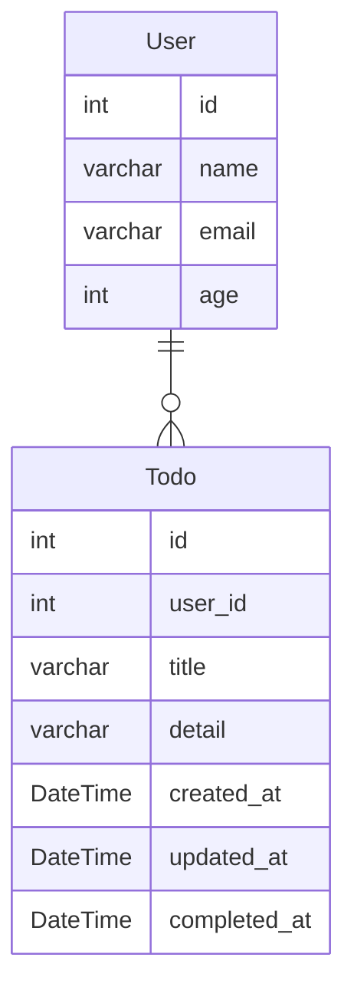

# go-todo-app
golangでTodoアプリの作成。

## setup

### ent.(ORM)

```terminal
//code generatorを備えているためCLIツールを取ってくる
go get entgo.io/ent/cmd/ent

//MySQLドライバ
go get github.com/go-sql-driver/mysql

//スキーマの初期化
go run entgo.io/ent/cmd/ent init User Todo

//もろもろファイル生成
go generate ./ent

//マイグレーション実行確認
docker-compose exec db mysql -u docker -pdocker todo-app
```

### test

```terminal
//testcontainers
go get github.com/testcontainers/testcontainers-go

//testify(テスティングフレームワーク)
go get github.com/stretchr/testify

//gomock
go install github.com/golang/mock/mockgen@v1.6.0
```

## ER図

